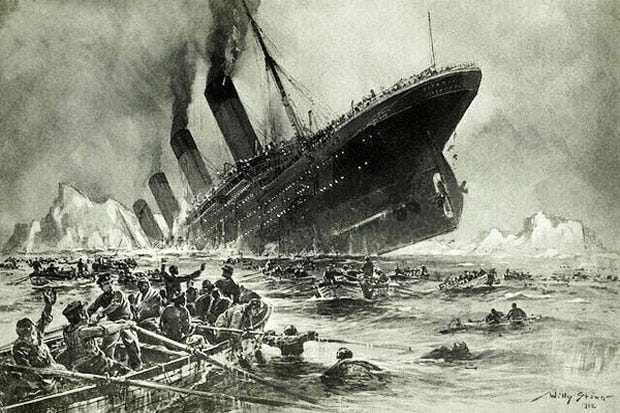
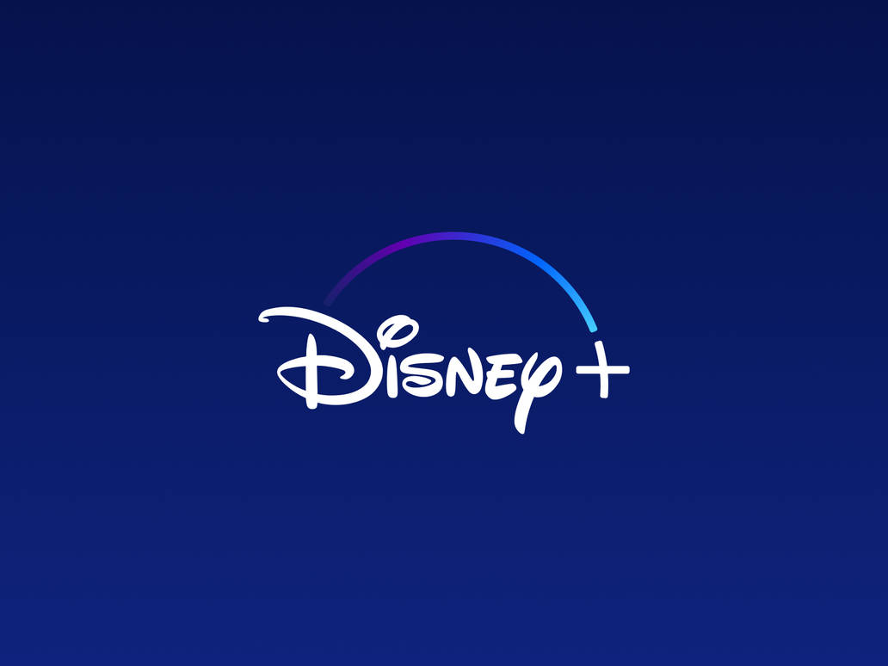

# Data Science Student

## Education
- B.S., Data Science @ University of California - San Diego, Class of 2025

## Technical Skills
- C++, Excel, Python, SQL, Git/Github, R, Tableau, Jupyter Notebook

## Projects

### Predicting Recipe Ratings

This was my final project for my dsc80 class. I was given a raw dataset, taken from food.com, of recipes along with ratings and reviews given by real people. I started by cleaning the raw dataset to keep only relevant columns. I then ran an exploratory data analysis and created visuals to get an understanding of the different variable, and their relationship with others. Next, created a Random Forest Classification mode, and used Grid Search CV to determine the best hyperparameters for the model. After trying many different combinations of variables, I was able to create a model with an F-1 score of 0.91. Learn more about this project [here](https://jahnavi-naik.github.io/recipe-analysis/)

### Will Driver Accept the coupon?

I completed this project with a group in my CS105 class. We found the dataset through the UCI repository, cleaned the data, created visualizations to display different aspects of the data, and ran a K Nearest Neighbors Analysis, yeilding a model with 66% accuracy. All work was done using Python though Jupyter Notebook. Thorugh this project, I got real experience collaborating with my group members and splitting up the work in an effecient way. I learned the importance of constant communication to successfully complete the project. [Github Link](https://github.com/jahnavi-naik/DriverCouponProject)
  
### Titanic Survival

This Kaggle competition was about creating a model that would determine if the passenger survived or not, using the given data. I used the given training set to train my Decision Trees model, selecting my features using the select best k algorithm, and then used that model on the test set, obtaining an accuracy score of 78%. I did this work using Python using a Jupyter notebook, and later uploaded it to Kaggle. This project allowed my to expand my knowledge on various maching learning models, as I had never used the decidion trees model previously. It gave me lots of practice on cleaning and transforming the data on order for it to be used for the model, and gave me practice in python in general.
[Github Link](https://github.com/jahnavi-naik/TitanicKaggleProject)

### Disney Plus Statistics

For this project, I wanted to practice creating visualizations in Tableu. To do this, I first found a dataset from Kaggle containing statistics about the Disney Plus streaming service. I then cleaned the data and removed any NaNs in python with a Jupityr notebook, and finally uploaded the clean data to Tableu where I created different visualizations about the trends. This is my first project in Tableu, so it really allowed me to play with the different features and familiarize myself with all that it can do. It made me really understand the data and what is was telling me in order to create visualizations.
[Tableau Link](https://public.tableau.com/app/profile/jahnavi.naik/viz/DisneyPlusDashboard_16914335376510/Dashboard1)

